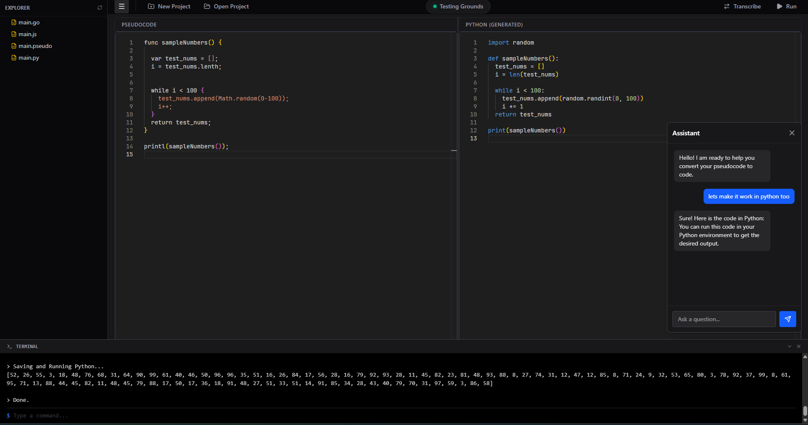

# PseudoIDE

**PseudoIDE** is a modern, AI-powered IDE designed to bridge the gap between thought and code. It allows developers to write logic in plain English (pseudocode) and instantly transcribe it into executable code in multiple languages, all running locally.



## 🚀 Key Features

*   **Pseudocode-First Development**: Write your logic in natural language; let the AI handle the syntax.
*   **Multi-Language Transpilation**: Instantly convert pseudocode to **Python**, **JavaScript/TypeScript**, **Go**, **Rust**, **C++**, and **C**.
*   **Local AI Inference**: Powered by local LLMs (Qwen 2.5) via `llama.cpp` for privacy and offline capability.
*   **Dual-Pane Editor**: View your high-level logic and generated implementation side-by-side.
*   **Integrated Execution Environment**: Run generated code directly within the IDE with a built-in terminal.
*   **Persistent Project Management**: Create, open, and manage projects with full file persistence.
*   **Interactive Shell**: Interact with your running programs via stdin/stdout directly in the UI.

## 🛠️ Tech Stack

*   **Frontend**: React, TypeScript, Vite, TailwindCSS, Monaco Editor
*   **Backend**: Rust (Tauri), standard `std::process` for execution
*   **AI Engine**: `llama-cpp-rs` / `llama.cpp` (GGUF models)
*   **Desktop Framework**: Tauri v2

## 📦 Installation & Setup

### Prerequisites
*   **Node.js** (v18+)
*   **Rust** (Stable)
*   **C++ Build Tools** (Visual Studio Build Tools on Windows)

### Build from Source

1.  Clone the repository:
    ```bash
    git clone https://github.com/yourusername/PseudoIDE.git
    cd PseudoIDE
    ```

2.  Install frontend dependencies:
    ```bash
    npm install
    ```

3.  Run in development mode:
    ```bash
    npm run tauri dev
    ```

4.  Build for production:
    ```bash
    npm run tauri build
    ```

## 📝 Usage

1.  **Open or Create a Project**: Use the top bar to initialize a new workspace.
2.  **Write Pseudocode**: In the left pane, describe your algorithm (e.g., `FUNCTION fib(n): IF n < 2 RETURN n...`).
3.  **Transcribe**: Click the "Transcribe" button (or `Ctrl+Enter`) to generate code.
4.  **Run**: Click "Run" to execute the generated code in the built-in terminal.

## 🤝 Contributing

Contributions are welcome! Please feel free to submit a Pull Request.

## 📄 License

MIT License
